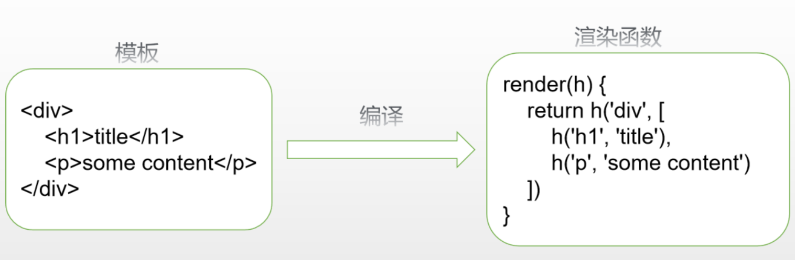

#  vue中的虚拟dom

1. vue1的原理是通过Object.defineProperty实现响应式，每个数据修改都能通知dom去更新，但造成了大量开销。

2. vue2中响应式的级别修改了，每一个组件一个watcher实例，这样状态变化只能通知到组件，组件内部再通过虚拟dom去进行比对和渲染。

3. 需**注意**组件的数量和watcher实例并不是相同的，因为会有一部分watcher是通过watch或者$watch创建的，这种watcher叫做用户watcher，而组件对应的watcher叫渲染watcher。

## 模板编译

模板编译的主要目标是将模板(template)转换成渲染函数(render)



### 1.模板编译过程

实现模板编译共有三个阶段：解析、优化和代码生成。

#### 解析- parse

  解析器将模板解析成抽象语法树AST(js对象)，只有将模板解析成AST后，才能基于它做优化或者生成代码字符串

#### 优化- optimize

优化器的作用是在AST中找出静态子树并打上标记，静态子树是在AST中永远不变的节点，如纯文本节点。

标记静态节点的好处有：

1. 每次重新渲染不需要为静态子树创建新节点
2. 虚拟DOM patch时，可以跳过静态子树

标记过程有两部：

1. 找出静态节点并标记
2. 找出静态根节点并标记

#### 代码生成 - generate

将AST转换成渲染函数中的内容，即代码字符串

```html
<div><p v-if="show">hello</p><p v-else>world</p></div>
```

to:

```javascript
_c('div',[(show)?_c('p',[_v("hello")]):_c('p',[_v("world")])])// _c是新建虚拟dom
```

### 2.v-if、v-for的处理

v-if和v-for指令是结构性指令，只是在编译器阶段处理，**如果我们要在render函数处理条件或循环只能使用js的if和for**

1. 在解析过程中，为AST添加if表示条件，添加ifConditions表示各自情况对应的结果
2. 代码生成时，根据if和ifConditions生成三元表达式
3. v-for循环则是执行for循环

### 3.插槽

**普通插槽**是在父组件编译和渲染阶段生成的vnodes，数据的作用域是父组件，子组件渲染的时候直接拿到这些渲染好的vnodes。

**作用域插槽**，父组件在编译和渲染阶段并不会直接生成vnodes，而是在父节点保留一个**scopedslots对象**，存储着不同名称的插槽以及他们对应的**渲染函数**，只有在**编译和渲染子组件阶段**才会执行这个渲染函数生成的vnodes，由于是在子组件环境执行的，所以对应的数据作用域是**子组件实例**。

两种插槽的目的都是让子组件slot占位符生成的**内容**由父组件来决定，但数据的**作用域**会根据他们**vnodes渲染时机**不同而不同。

### 4. 常见问题

1. vue中虚拟dom如何创建？

   通过parse函数解析模板把template解析成语法解析树AST

   代码优化，如静态节点标记

   代码生成，把AST生成可执行的代码，如v-if生成对应的代码字符串

   ```html
   <div><p v-if="show">hello</p><p v-else>world</p></div>
   ```

   to:

   ```javascript
   _c('div',[(show)?_c('p',[_v("hello")]):_c('p',[_v("world")])])// _c是新建虚拟dom
   ```

2. vue中虚拟dom如何diff？

   web数组常见的修改：

   1. 新增元素
   2. 删除元素
   3. 倒序排列一个元素

   所以遍历前先做：

   1. 新老排头一样，直接进行更新元素的逻辑，而不需要用数组做diff这个元素了。
   2. 新老数组排尾一样
   3. 老的排头和新的排尾是否一致
   4. 老的排尾是否和新的排头是否一致

